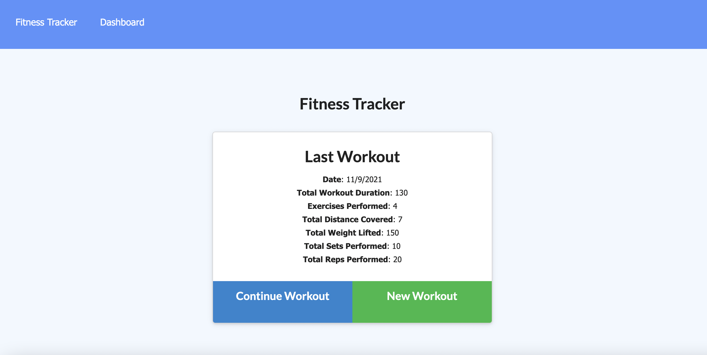
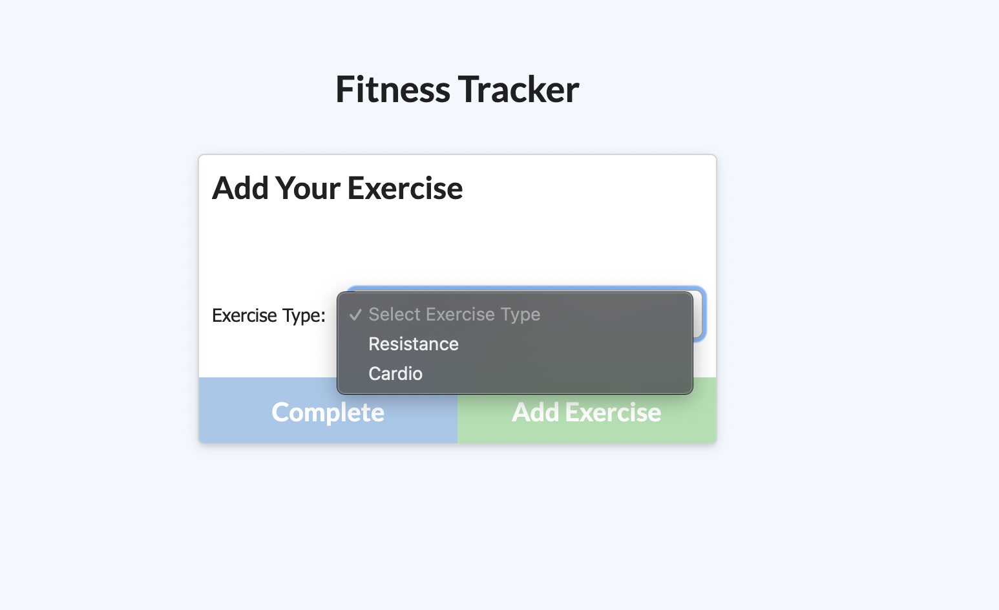
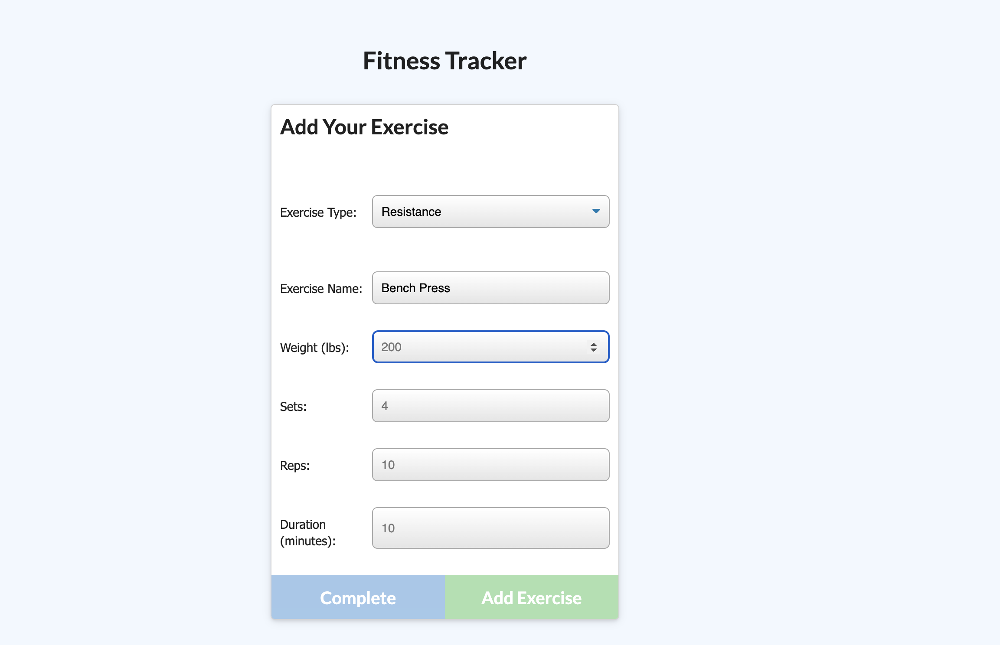
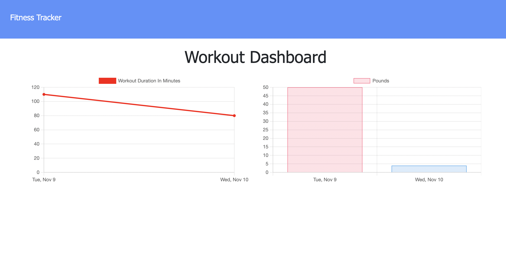

# Workout Fitness Tracker

  

  ## Description
  On the click of just a few buttons, track exercises by creating and viewing each that you choose on any given day. Log multiple exercises in a workout, as well as many workouts in a day. Keep track of specific data such as date, type of exercise, name, weight, sets, reps and duration. Distance traveled can be tracked as well if the exercise is cardio. 

  ## Table of Contents
  * [Installation](#installation)
  * [Usage](#usage)
  * [Credits](#credits)
  * [License](#license)
  * [Contact](#contact)

  ## Installation
  Clone repository. Run "npm install". All packages (express, mongoose, and morgan) should be installed.

  ## Usage
  Whether the tracker is run locally ("node server.js" in command line) or live, add a new workout by selecting the "New Workout" button. Choose which type of exercise and fill in the appropriate boxes. Add this exercise to the workout and continue doing so until the workout itself is finished. Click "Complete Workout" to finish or pick right back up where you left off. Click "Dashboard" in the navigation bar to view 2 graphs of stats, total duration and weight over 7 days.

  Click [here](https://fitness-tracker-1016.herokuapp.com/?id=618aee59ead2675090acacc8) to view live deployed application.

  
  
  
  

  
  ## Credits
  Contributors to the project: Starter public and seed folder code provided by Georgia Institute of Technology.

  ## License
  License for this project: [MIT License](https://choosealicense.com/licenses/mit/)

  ## Contact
  With any questions or concerns, please contact me via GitHub at [cianfich1016](https://github.com/cianfich1016) or by email at cianfich@gmail.com.